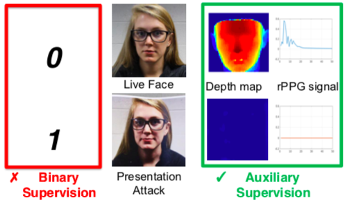
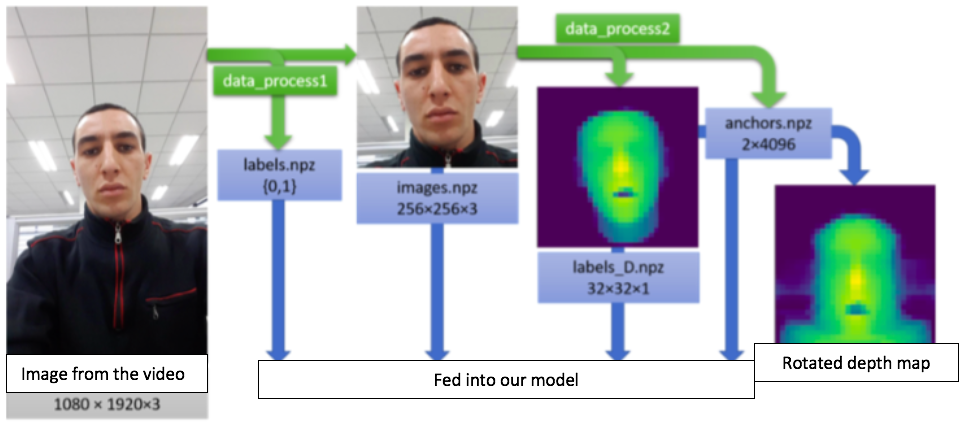
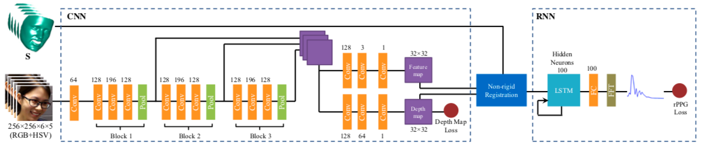

# Face-Anti-Spoofing-Neural-Network

This repository contains a PyTorch implementation of the Paper ['Learning Deep Models for Face Anti-Spoofing: Binary or Auxiliary Supervision' - Yaojie Liu, Amin Jourabloo, Xiaoming Liu from Michigan State University.](http://cvlab.cse.msu.edu/pdfs/Liu_Jourabloo_Liu_CVPR2018.pdf)

## Goal of the system
This model is able to discriminate between sequences showing live and spoof faces and can therefore be applied to biometric security systems.  

The innovative aspect of this approach is that the decision is made based on two explicit criteria: the depth map and the estimated rPPG signal. 

## Data cleaning process

Using the [OULU](http://www.ee.oulu.fi/~jukmaatt/papers/FG2017_OULU-NPU.pdf) dataset as training examples, the labels have been generated using [Face Alignment in Full Pose Range: A 3D Total Solution](https://github.com/cleardusk/3DDFA) for the depth map and [Heartbeat: Measuring heart rate using remote photoplethysmography (rPPG)](https://github.com/prouast/heartbeat) for the heartbeat signal.

## System architecture

## Ameliorations suggested in this project
Instead of using the depth map labels as coordinates for the rotation of the face (in the non-rigid registration layer), we train a multi layer perceptron, called 'Anti_spoof_net_rotateur', to perform it. With this amelioration, the system if fully autonomous. 

